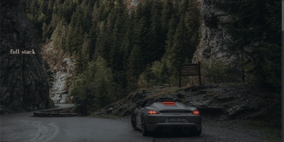

# Reinis Vāravs – Portfolio Website

This is my personal portfolio built with React and GSAP. It showcases my development work, tech stack, and personal background as a full-stack JavaScript developer based in Latvia.

---

## 🚀 Tech Stack

- **Frontend**: React.js + Vite
- **Styling**: Custom CSS, GSAP animations
- **Backend (in projects)**: Node.js, Express
- **Database (in projects)**: PostgreSQL
- **APIs / Tools**: OpenAI, Stripe, Discord.js

---

## 🎨 Design Highlights

- Bold, animated hero section with Dorsa font
- Responsive layout for all screen sizes
- Smooth GSAP scroll and hover animations
- Background video + high-res image transitions
- Tech stack visual display and animated elements

---

## 🎥 Animated Preview

Here’s a quick look at the hero animation and page transition:

---

## 📦 Getting Started

To run the project locally:

    git clone https://github.com/your-username/your-portfolio.git
    cd your-portfolio
    npm install
    npm run dev

This starts the development server at `http://localhost:3000`.

---

## ✨ Features

- Animated entry transitions using GSAP
- Context-aware text effects
- Discord bot + OpenAI project integration
- Stripe & e-commerce UI components
- Local-first performance optimizations (self-hosted fonts, lazy assets)

---

## ☕ About Me

I'm a full-stack JavaScript developer from Latvia, building with the PERN stack, OpenAI, and GSAP.  
I love standout designs, solving real-life tech problems, music, coffee, and working out.

---

## 📬 Contact

Reach out via the contact form on the site or:

- [GitHub](https://github.com/your-username)
- [LinkedIn](https://linkedin.com/in/your-profile)

---

## 🪪 License

This project is open source and available under the [MIT License](LICENSE).
